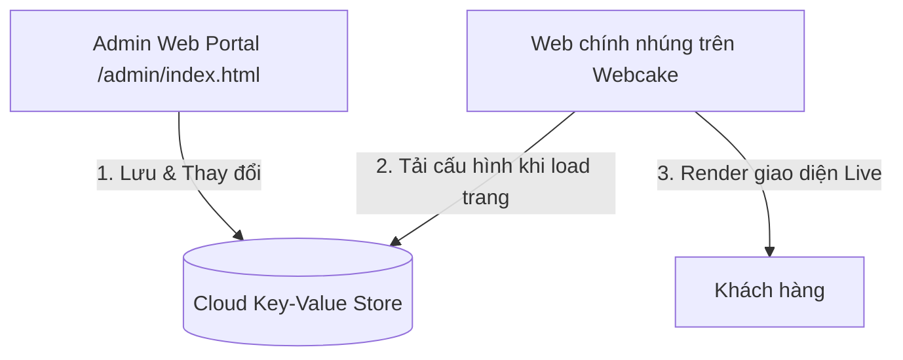

# Design Specification: Realtime Admin Portal for Dream Moto Night Ride

Dự án yêu cầu xây dựng một trang quản trị Realtime tự động cập nhật dữ liệu trực tuyến lên trang chính đang chạy trên Webcake mà không cần tải file và push Git thủ công.

## 1. Kiến trúc Hệ thống Realtime Serverless

Để đạt hiệu quả realtime nhanh chóng, hoàn toàn miễn phí và không cần dựng server backend riêng, hệ thống sẽ sử dụng phương thức **Cloud Key-Value API** (thông qua dịch vụ **KVdb.io** hoặc **Firebase Realtime Database REST API**).



### Chi tiết luồng xử lý:
1. **Admin Portal (`admin/index.html`)**:
   - Thêm phần cấu hình **Realtime Sync Settings** (nhập Key / Bucket ID, mặc định sẽ tự tạo một chuỗi ngẫu nhiên duy nhất).
   - Bấm nút **"LƯU CẬP NHẬT REALTIME"**: Toàn bộ dữ liệu JSON `DREAM_MOTO_DATA` sẽ được gửi (`POST`) trực tiếp lên Cloud Key-Value API.
   - Trạng thái lưu thành công được thông báo tức thì bằng hiệu ứng Neon Toast Notification.

2. **Main Landing Page (`app.js` & `dream-moto-webcake.js`)**:
   - Khi khách hàng truy cập website (kể cả phiên bản nhúng trên Webcake), script sẽ kiểm tra cấu hình URL Realtime.
   - Gửi yêu cầu `fetch` để lấy JSON mới nhất từ Cloud.
   - Nếu lấy thành công, override biến cục bộ `DREAM_MOTO_DATA` và gọi hàm render để cập nhật bảng giá, hotline, dịch vụ tức thì.
   - Nếu lỗi mạng hoặc chưa cấu hình, website sẽ tự động fallback về dữ liệu tĩnh lưu trong `data-config.js` (đảm bảo hoạt động 100% không bị ngắt quãng).

---

## 2. Các tệp tin cần thay đổi

### 1. `admin/index.html` (Trang Quản trị)
- Thêm Tab mới: **"Đồng bộ Realtime"**.
- Thêm giao diện quản lý cấu hình:
  - **Bucket ID / API URL**: Cho phép người dùng nhập Bucket ID riêng hoặc sử dụng ID tự sinh.
  - Nút **"LƯU REALTIME"** & **"TẢI DỮ LIỆU TỪ MÂY"** để đồng bộ 2 chiều.
- Viết JS gọi API `fetch(url, { method: 'POST', body: JSON.stringify(data) })`.

### 2. `data-config.js` (Cấu hình)
- Bổ sung trường cấu hình remote:
  ```javascript
  const DREAM_MOTO_DATA = {
    shopInfo: {
      // ...,
      realtimeBucketId: "dream-moto-night-default-key",
      realtimeSyncUrl: "https://kvdb.io/9k8Kx4z8X3s7s6s9/dream_moto_config"
    },
    // ...
  }
  ```

### 3. `app.js` (Script chạy Web chính)
- Thêm hàm `syncRealtimeData()` chạy không đồng bộ (async) trước khi render UI.
- Nạp đè dữ liệu mới và thực hiện cập nhật giao diện hiển thị.

### 4. `dream-moto-webcake.js` (Script chạy trên Webcake)
- Đồng bộ cơ chế tải cấu hình từ mây để trang Webcake hiển thị đúng giá realtime.

---

## 3. Kế hoạch xác thực

### Kiểm thử tự động
- Viết mock test trong Python kiểm tra tính chính xác của hàm nạp dữ liệu realtime và fallback.

### Kiểm thử thủ công
1. Truy cập Admin Portal -> Đổi giá Gói 1 thành `350.000đ` -> Bấm "Lưu Realtime".
2. F5 tải lại trang landing page chính -> Đảm bảo giá hiển thị đã tự đổi thành `350.000đ` mà không cần sửa file code hay push GitHub.
